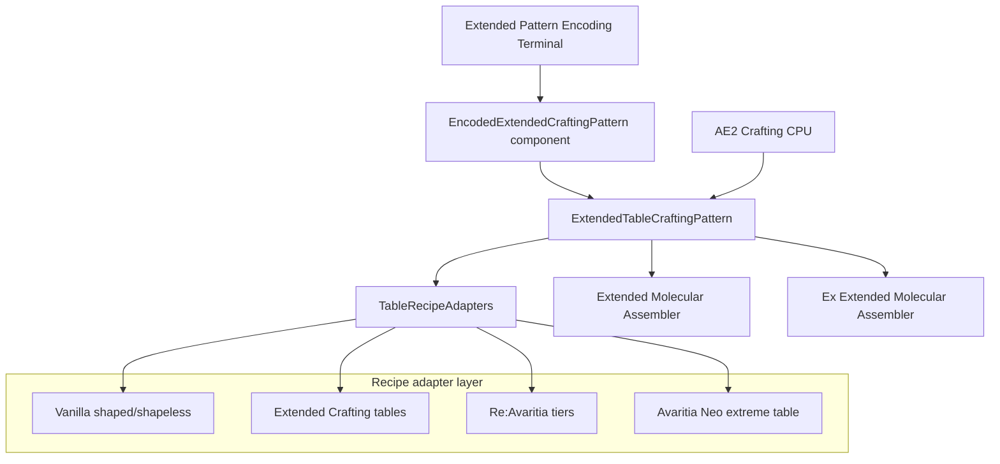
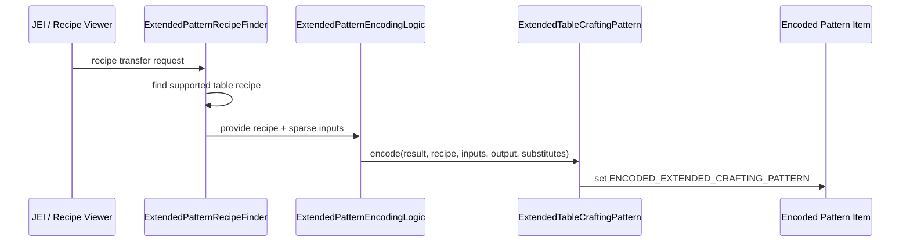
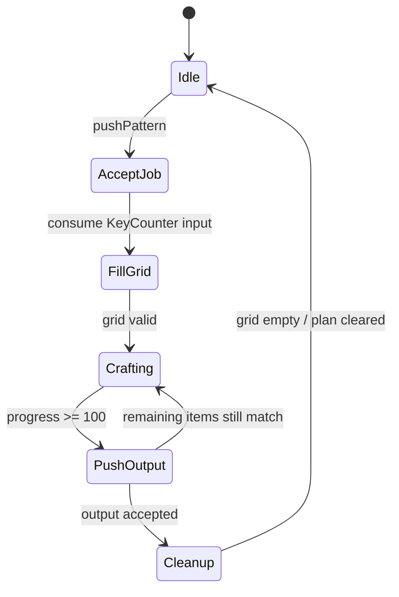
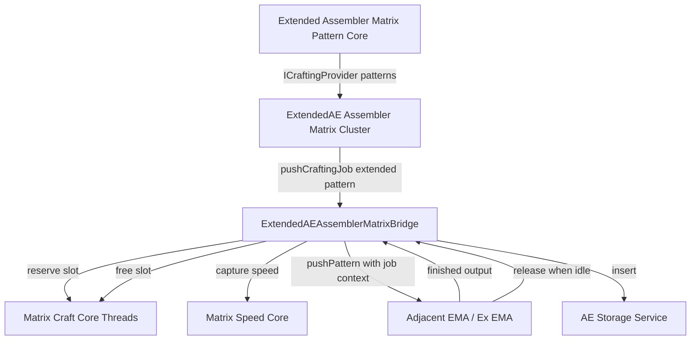
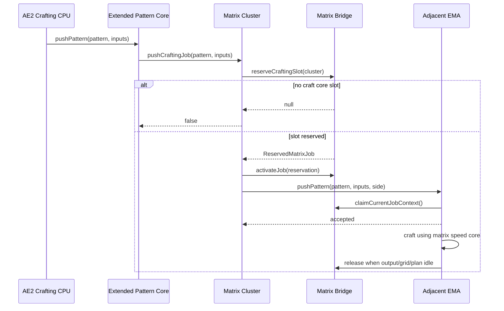
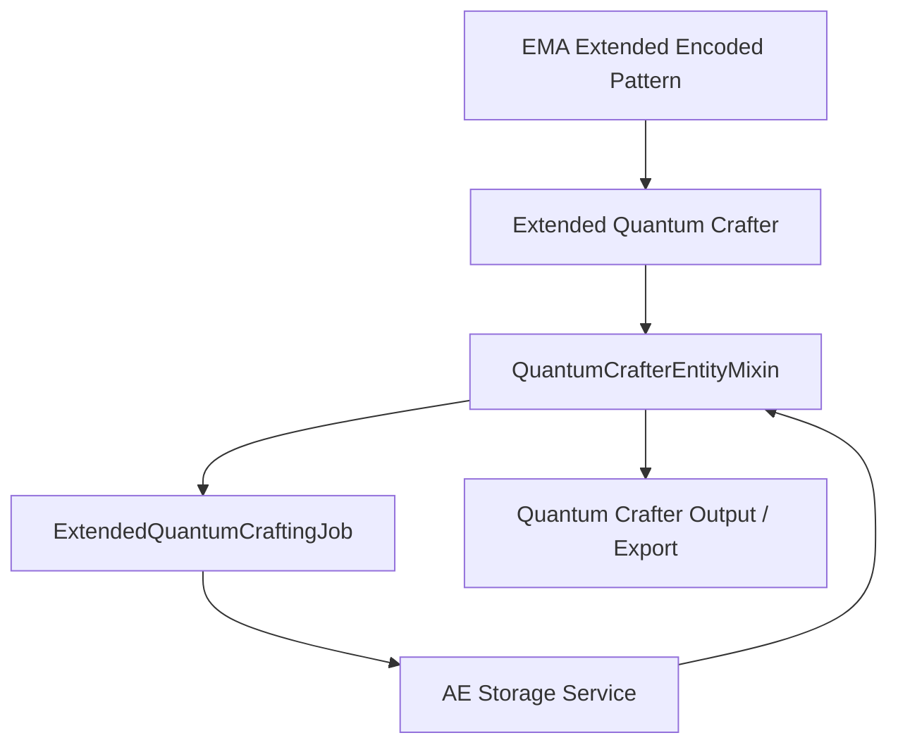

# Extended Molecular Assembler Workflow

Last updated: 2026-05-29

## Goal

`ExtendedMolecularAssembler`는 AE2 자동조합 패턴으로 3x3을 넘는 crafting table 계열 조합을 처리하기 위한 모듈이다.

현재 구현 방향은 다음과 같다.

- 기존 AE2 encoded pattern item을 그대로 쓰되, `ENCODED_EXTENDED_CRAFTING_PATTERN` data component에 확장 조합 정보를 저장한다.
- `Extended Molecular Assembler`는 단일 lane으로 조합한다.
- `Ex Extended Molecular Assembler`는 ExtendedAE의 Extended Molecular Assembler처럼 최대 8 lane을 병렬로 조합한다.
- ExtendedAE가 있을 때만 `Extended Assembler Matrix Pattern Core`를 등록하고, Assembler Matrix 안에서 36개 확장 패턴을 제공한다.
- Matrix에서 들어온 확장 조합은 실제 실행은 인접한 EMA/Ex EMA가 하되, Matrix의 craft core thread capacity와 speed core를 공유한다.
- AdvancedAE가 있을 때만 `Extended Quantum Crafter`를 등록하고, Quantum Crafter 계열에서 9x9 이하 확장 encoded pattern을 stock/craft loop에 포함한다.
- `Extended Quantum Crafter`는 현재 WIP 상태이므로 생존 조합법을 제공하지 않으며, 아이템 툴팁에 `[WIP]`를 표시한다.

## Main Components



## Pattern Encoding

`ExtendedPatternEncodingLogic`와 integration recipe finder가 JEI/recipe transfer에서 확장 crafting recipe를 찾고, `ExtendedTableCraftingPattern.encode(...)`가 pattern stack에 metadata를 기록한다.

저장되는 핵심 정보:

- recipe id
- sparse input stacks
- expected output
- substitute 허용 여부
- table type
- table tier
- table side length

이 metadata 때문에 Extended Crafting, Re:Avaritia, Avaritia Neo 같은 서로 다른 table family를 하나의 pattern 구현으로 구분할 수 있다.



## Assembler Execution

`ExtendedMolecularAssemblerBlockEntity` owns one or more `CraftingLane`s.

- `Extended Molecular Assembler`: `laneCount = 1`
- `Ex Extended Molecular Assembler`: `laneCount = 8`

Each lane has its own 9x9 machine grid plus one output slot. The machine grid is always 9x9, while the encoded recipe metadata decides how the smaller or tiered recipe grid is centered into that machine grid.



Speed behavior:

- Normal EMA jobs use installed AE2 speed cards.
- Matrix-dispatched jobs use the captured ExtendedAE Matrix speed core value instead.

Output behavior:

- If the output side is adjacent to an ExtendedAE Matrix block, the output is first inserted into the Matrix AE storage network.
- If that fails or only partially inserts, normal adjacent inventory insertion is attempted.

## ExtendedAE Matrix Integration

ExtendedAE integration is optional and is registered only through `MyotusAPI.INTEGRATION.modIntegrationManager()` when ExtendedAE is loaded.

Important files:

- `EMAOptionalIntegrations`: common-side optional integration gate
- `EMAExtendedAEIntegration`: ExtendedAE-only registrations
- `ExtendedAssemblerMatrixPatternCoreBlockEntity`: 36-slot pattern core block entity
- `ExtendedAEAssemblerMatrixBridge`: shared matrix capacity, reservation, speed core context, and output insertion bridge
- `CalculatorAssemblerMatrixMixin`: lets Extended Pattern Core count as a valid matrix pattern block
- `ClusterAssemblerMatrixMixin`: routes extended patterns from Matrix to adjacent EMA/Ex EMA
- `TileAssemblerMatrixPatternMixin`: lets normal Matrix pattern core report not busy when extended jobs can still be accepted
- `TileAssemblerMatrixPatternFilterMixin`: permits extended encoded patterns in Matrix pattern slots
- `GuiAssemblerMatrixMixin`: Matrix screen toolbar transition button; opens the EMA extended-pattern page from the normal Matrix GUI
- `ExtendedAssemblerMatrixPatternCoreScreen`: Matrix-style dedicated extended-pattern page with shared-resource status text and a back button



## Matrix Job Dispatch

ExtendedAE's own `TileAssemblerMatrixCrafter` still handles normal matrix-supported patterns. Extended table patterns are dispatched to adjacent EMA/Ex EMA, but they reserve one Matrix craft thread until the EMA lane is fully idle.

This gives the intended resource behavior:

- normal matrix jobs consume craft core capacity
- extended matrix jobs consume the same craft core capacity
- if normal jobs fill all craft core threads, extended jobs wait
- if extended jobs reserve all craft core threads, normal jobs wait
- Matrix running-thread display includes both ExtendedAE busy crafters and EMA reservations
- Matrix cancel action stops both ExtendedAE crafter threads and reserved EMA matrix jobs



## AdvancedAE Quantum Crafter Integration

AdvancedAE integration is optional and is registered only when the `advanced_ae` mod is loaded.

Important files:

- `EMAOptionalIntegrations`: common optional integration gate for ExtendedAE and AdvancedAE
- `EMAAdvancedAEIntegration`: AdvancedAE-only block/item/block-entity registration and AE capability hookup
- `ExtendedQuantumCrafterBlock`: AdvancedAE `QuantumCrafterBlock` subclass for the EMA extended variant
- `ExtendedQuantumCraftingJob`: shared extended pattern stock/craft bookkeeping for Quantum Crafter execution
- `QuantumCrafterEntityMixin`: lets AdvancedAE's Quantum Crafter accept EMA extended encoded patterns, expose stock config for them, persist per-slot min/max stock settings, and perform 9x9-or-smaller crafting against AE storage

`Extended Quantum Crafter` intentionally reuses AdvancedAE's Quantum Crafter block entity class. This keeps AdvancedAE menu/logic compatibility while giving EMA a distinct registered block whose block entity type contains the EMA block instance.



## Screen And Menu Work

Implemented UI pieces:

- EMA screen/menu follows AE2 Molecular Assembler-style inventory layout.
- Ex EMA reuses the assembler screen but exposes parallel lane state.
- Ex EMA menu syncs each lane's current pattern stack separately, then enables only the selected page's slots like ExtendedAE's Ex Molecular Assembler. This lets page 2-8 render the active recipe shape instead of only page 1.
- Extended Pattern Encoding Terminal has pattern encoding UI and recipe transfer integration.
- Extended Assembler Matrix Pattern Core screen uses the Assembler Matrix-style UI assets and has 36 encoded-pattern slots.
- The normal ExtendedAE Assembler Matrix screen has a toolbar button labeled as an extended-pattern page transition instead of a separate machine screen.
- The extended-pattern page keeps the Matrix context visible: it shows running Matrix threads and a shared-resource note because speed core and processing/craft-core capacity are the same resources used by the base Matrix.
- The page has a back toolbar button that reopens the normal Assembler Matrix GUI for the same Matrix cluster.
- Matrix and Extended Pattern Core screens have toolbar buttons to switch between the Matrix screen and the Extended Pattern Core screen.
- Extended Quantum Crafter currently relies on AdvancedAE's existing Quantum Crafter UI/menu path through the reused block entity type.
- GuideME entry is present under `assets/extendedmolecularassembler/ae2guide`.

## Dev Recipes And Game Tests

Dev/test data added:

- Extended Crafting tier test recipes
- Re:Avaritia tier 1-4 test recipes
- Avaritia Neo / Re:Avaritia / Extended Crafting dev-only vanilla-material recipes

Existing GameTests currently verify pattern encoding and crafting for supported tiers.

Assembler dispatch GameTests also cover the core push path:

- `extendedAssemblerAcceptsOnePushedJob`: verifies a single-lane EMA accepts one pushed extended pattern, fills its lane grid from AE2 counters, and refuses a second job while busy.
- `exAssemblerAcceptsOneJobPerLane`: verifies Ex EMA exposes eight lanes, accepts one pushed extended pattern per lane, fills each lane grid, and refuses a ninth job when all lanes are busy.

A direct ExtendedAE Matrix formation/dispatch GameTest is not implemented yet because those classes are optional-load sensitive and need a clean test isolation pass.

## Verification Commands

Use Windows Gradle wrapper from this module.

```bash
cmd.exe /c "gradlew.bat compileJava --console=plain"
cmd.exe /c "gradlew.bat runGameTestServer --console=plain"
cmd.exe /c "gradlew.bat runGameTestServer --console=plain -Penable_extendedae=false"
cmd.exe /c "gradlew.bat runGameTestServer --console=plain -Penable_advancedae=false"
cmd.exe /c "gradlew.bat build --console=plain"
```

Last verified:

- 2026-05-30: `/mnt/c/Windows/System32/cmd.exe /c "gradlew.bat compileJava --console=plain"` passed after Matrix extended-pattern page UI text update.
- 2026-05-30: `/mnt/c/Windows/System32/cmd.exe /c "gradlew.bat runGameTestServer --console=plain"` passed with ExtendedAE + AdvancedAE enabled after Matrix extended-pattern page UI text update; 6 required GameTests passed.
- 2026-05-30: `/mnt/c/Windows/System32/cmd.exe /c "gradlew.bat compileJava --console=plain"` passed after AdvancedAE Extended Quantum Crafter registration.
- 2026-05-30: `/mnt/c/Windows/System32/cmd.exe /c "gradlew.bat :neoforge-1-21-1:compileJava :forge-1-20-1:compileJava --console=plain"` passed from the multiversion root.
- 2026-05-30: `/mnt/c/Windows/System32/cmd.exe /c "gradlew.bat runGameTestServer --console=plain"` passed with ExtendedAE + AdvancedAE enabled; 6 required GameTests passed.
- 2026-05-29: `/mnt/c/Windows/System32/cmd.exe /c "gradlew.bat compileJava --console=plain"` passed.
- 2026-05-29: `/mnt/c/Windows/System32/cmd.exe /c "gradlew.bat runGameTestServer --console=plain"` passed; 6 required GameTests completed in 1.484 s.
- 2026-05-29: `/mnt/c/Windows/System32/cmd.exe /c "gradlew.bat build --console=plain"` passed.
- Earlier: `runGameTestServer -Penable_extendedae=false` passed.

## Current Caveats

- Extended patterns placed in the Matrix are executed by adjacent EMA/Ex EMA, not by ExtendedAE's internal `TileAssemblerMatrixCrafter`, because ExtendedAE's internal crafter only supports its normal molecular-assembler pattern contract.
- Extended Quantum Crafter uses AdvancedAE's Quantum Crafter entity type and tick/menu behavior, plus an EMA mixin for extended patterns; it is not a separate screen implementation yet.
- The current Matrix integration reserves Matrix craft capacity and speed core state, but it does not reuse ExtendedAE's private internal crafter worker object for the extended recipe execution.
- Direct matrix multiblock GameTest coverage is still missing.
- The project tree is mostly untracked right now, so review with `git status --short` before making commit boundaries.
